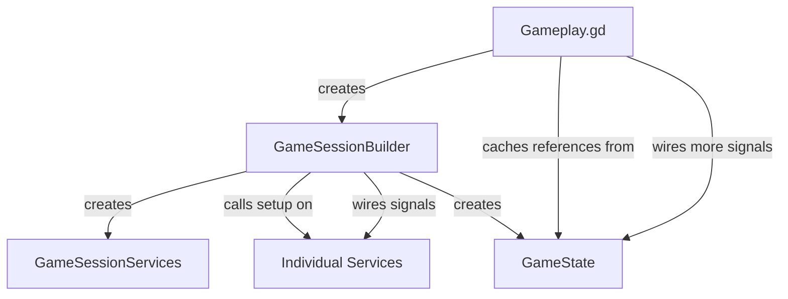
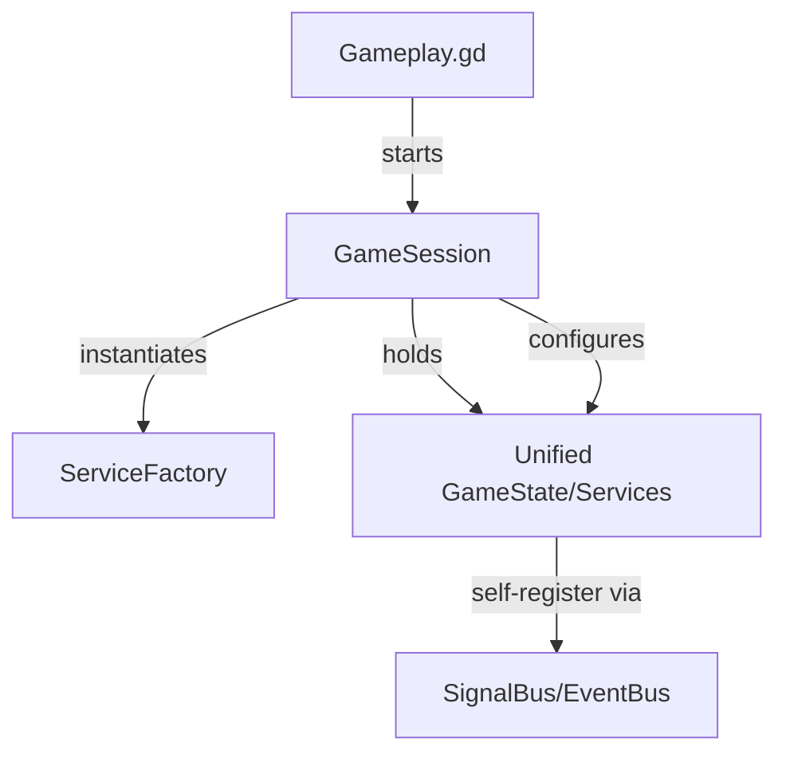

# Design: Core Architecture Refactor

## Current State


## Proposed State


## Key Components

### 1. Unified `GameState`
Merge `GameSessionServices` into `GameState`. `GameState` will be the single source of truth for all services and session-level data.

### 2. `GameSession` Node
A new `Node`-based class that manages the lifecycle of a gameplay session.
- Handles initialization of all services.
- Manages the scene tree for service nodes.
- Orchestrates top-level signal connections.

### 3. Standardized Service Setup
All services should implement a consistent interface:
```gdscript
func setup(session: GameSession) -> void:
	_unit_manager = session.state.unit_manager
	# ...
```

### 4. Thin `Gameplay.gd`
`Gameplay.gd` will become:
```gdscript
extends Node2D

func _ready():
	var level = _load_level()
	var session = GameSession.new(level)
	add_child(session)
	session.session_ended.connect(_on_session_ended)
```
